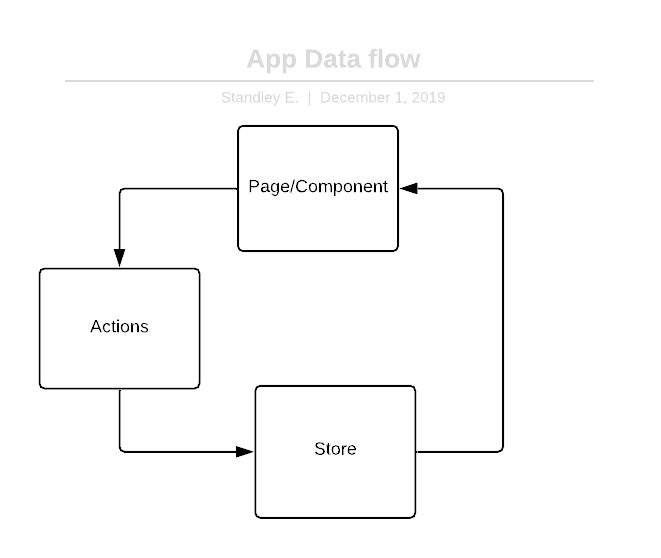

# Capstone-Sweng 894

The ui front-end is broken up into four function layers:

- ** Presentation **
- ** Store/Data **
- ** Validation/Utilites **
- ** Config **

## Design 
The front-end ui is made up of the Presentation, Store/Data, and Validation/Utilites sections which 
our broken up between 3 to 4 folders. The Presentation section is made-up of the 
components, image, navigation, and pages folders. The Store/Data section is broken up between the
actions, reducers, and store folders. The Validation/Utilites section is made-up of utilites, validation,
and config folders. 

### Presentation
The viewable layer of the application is made-up of pages which are combinations of several components. 

Navigation between pages and components are handled using the [react-navigation](https://www.npmjs.com/package/react-navigation) lib 

The final part of the presentation section are image's. A general purpose folder with pre-set buisness icons and logo.
One of the design desicion made during the later sprint was to remove individual buisness icons and replace it with 
general style icons.

### Store/Data
The application is using redux to manage store of individual domain data. The stores are made-up of 5 domains 

- appointments
    - SetPreviousAppointment
    - GetPreviousAppointment
    - GetPreviousAppointmentFullFilled
    - GetPreviousAppointmentReject
    - SetUpcomingAppointment
    - GetUpcomingAppointment
    - GetUpcomingAppointmentFullFilled
    - GetUpcomingAppointmentReject
    - ReplaceAppointment
    - DeleteAppointment
    - SetAllAppointment
    - GetAllAppointment
    - GetAllAppointmentFullFilled
    - GetAllAppointmentReject
- auth
    - userSet
    - tokenSet
    - userAuthError
- preference
    - setPreference
    - settingPref
    - setStyles
    - GetStylePreference
    - GetStylePreferenceFullFilled
    - GetStylePreferenceReject
    - GetPreference
    - GetPreferenceFullFilled
    - GetPreferenceReject
- profile
    - setProfile
    - GetProfile
    - GetProfileFullFilled
    - GetProfileReject
- provider
    - SetProviderSearch
    - alreadyFetch
    - GetProvider
    - GetProviderFullfilled
    - GetProviderReject
    - SetProviderDetails
    - GetProviderDetails
    - GetProviderDetailFullFilled
    - GetProviderDetailsReject

Each domain has there our actions that holds that domain specific business logic. This starts with a front-end page/component sending a request for an action (dispatch) that then sends an object to the store that triggers store changes per business logic.

All the domain stores are combed together into one central store that connects the page or component to the store
to access necessary data.

### Validation/Utilites
The field validation and general utilites are stored in two folder. The validation covers all the field inputs from numerical to text with lenght. The utilites are functions that are used in common between pages or components. One example are api submission to create users or appointments. 

### Config
We are using firebase to handle authentication and verificiation of users with one or more sign-in methods. For our app we made the design desicion to only allow user create from username and password. The configuration for firebase is fairly samply and is housed in one confirguration.

## Security

We're leavaging firebase to handle security for the front-end.

